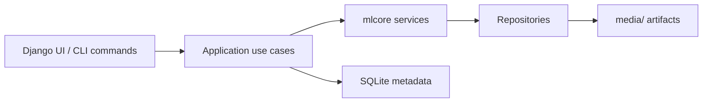

# Reproducible ML Research Platform for Crypto Price Movement Classification

Django-based research dashboard for running reproducible ML pipelines on
Binance or CSV OHLCV data. The project prepares datasets, trains baseline and
main models, saves local artifacts, records metadata, and provides research
utilities for time-aware model evaluation.

This is a standalone pet/research ML project, not a trading product.

## What This Project Is / Is Not

This project is:

- a reproducible ML pipeline for OHLCV-based binary classification;
- a Django research dashboard for running and inspecting experiments;
- a local experiment tracking system with SQLite metadata and file artifacts;
- a playground for leakage-aware validation, baselines, reports, and research
  checks.

This project is not:

- a trading bot;
- financial advice;
- a production trading system;
- a claim that short-term crypto prices are reliably predictable.

## Features

- CSV raw OHLCV ingestion through UI and CLI.
- Binance Spot OHLCV ingestion through UI and CLI.
- Raw, processed, and final dataset artifacts.
- DummyClassifier naive baseline.
- LogisticRegression baseline with `StandardScaler`.
- CatBoostClassifier main model.
- Binary classification metrics: accuracy, precision, recall, f1, roc_auc, and
  confusion matrix.
- Generated reports:
  - target distribution;
  - metrics comparison;
  - CatBoost feature importance;
  - period stability table and plot.
- Run detail page with artifact links, metric summaries, inline PNG reports, and
  stability table preview.
- Research utilities:
  - period stability analysis;
  - walk-forward fold generation;
  - walk-forward evaluation CLI;
  - feature ablation CLI.
- Local script for freezing real Binance OHLCV datasets with a SHA256 manifest.
- PostgreSQL BI SQL views for Grafana/Metabase analytics.

## Screenshots

Dashboard overview:


Binance pipeline form:


Run detail metrics and stability preview:


Run detail report gallery:


## Architecture Overview



The core design separates Django orchestration from ML logic:

- Django views and management commands handle forms, CLI arguments, redirects,
  and user-facing flow.
- Use cases coordinate complete actions such as CSV upload, Binance pipeline
  runs, and `PipelineRun` execution.
- `mlcore` contains reusable, Django-independent data preparation, training,
  evaluation, reporting, repository, and research services.
- SQLite stores metadata only.
- Datasets, models, and report files are stored in local filesystem artifacts.

## Data / ML Pipeline

```text
raw OHLCV
-> clean
-> build features
-> build target
-> time-based split
-> train dummy / baseline / CatBoost
-> evaluate
-> save models, metrics, datasets, and reports
```

Current target definition:

```text
target = 1 if close(t + horizon) > close(t), else 0
```

The main pipeline uses a global time-based holdout split. Rows are sorted by
`timestamp`; random shuffle is not used.

## Research Components

- Leakage control:
  - no random train/test shuffle;
  - timestamp, symbol, and target are excluded from model features;
  - future close used for target construction is not kept as a model feature.
- Time-based train/validation/test split.
- Dummy baseline for naive majority-class comparison.
- Period stability analysis over test predictions.
- Walk-forward validation service for sequential folds.
- Walk-forward evaluation command for fold-by-fold trainer evaluation.
- Feature ablation service and CLI for comparing feature group removal.

These tools are research aids. They make model behavior easier to inspect, but
they do not prove profitability.

## Research Results

Current public research results are summarized in the
[research conclusions](docs/research_conclusions.md).

The current frozen real-data smoke benchmark uses `BTCUSDT`, `1h`,
`2025-01-01` to `2025-01-10`, target horizon `3`, and chronological
walk-forward folds. In that short run, the strongest trainer by mean F1 is the
LogisticRegression baseline (`f1_mean=0.3757`, `roc_auc_mean=0.6153`), but the
bootstrap F1 interval is wide (`[0.1538, 0.5217]`) because there are only `3`
folds.

Error analysis is deliberately visible: the baseline smoke run produced `72`
walk-forward predictions, `39` errors, error rate `0.5417`, `29` false
positives, and `10` false negatives. Regime analysis shows metrics vary by
volatility/trend bucket, and feature ablation found `without_moving_average` as
the best smoke split by F1 (`0.5000`) with only a small delta over all features.

The useful conclusion is about reproducibility and robustness inspection, not a
tradable signal. The current reports show how to freeze data, run time-aware
validation, inspect errors, compare regimes, and audit feature groups. They do
not establish stable market predictability.

Detailed reports:

- [Real data walk-forward benchmark](docs/real_data_walk_forward_benchmark.md)
- [Real data regime analysis](docs/real_data_regime_analysis.md)
- [Real data error analysis](docs/real_data_error_analysis.md)
- [Real data feature ablation report](docs/real_data_feature_ablation.md)

## Quickstart

Generic local setup:

```powershell
python -m venv .venv
.\.venv\Scripts\python.exe -m pip install -r requirements.txt
.\.venv\Scripts\python.exe manage.py migrate
.\.venv\Scripts\python.exe manage.py runserver
```

Open:

```text
http://127.0.0.1:8000/
```

Optional Django environment variables:

- `DJANGO_SECRET_KEY`: set a local development secret when you do not want to
  use the fallback placeholder;
- `DJANGO_DEBUG`: set to `True` or `False`;
- `DJANGO_ALLOWED_HOSTS`: comma-separated host list, for example local hostnames.

Local development defaults are defined in `config/settings.py`, so the project
can run without a `.env` file. Use `.env.example` as a reference if you want to
set shell-level environment variables. Do not commit a real `.env` file.

This workspace has been developed and checked with a local `.crypto` virtual
environment, so task verification commands use:

```powershell
.crypto\Scripts\python.exe ...
```

## Docker Local Stack

The project also includes a local Docker Compose stack with Django and
PostgreSQL. It is intended for local containerized testing, not server
deployment.

```powershell
docker compose build
docker compose up
```

Open:

```text
http://localhost:8000/
```

Stop the stack:

```powershell
docker compose down
```

Docker uses PostgreSQL through `DATABASE_URL`. The local `.crypto` workflow
continues to use SQLite unless `DATABASE_URL` is set in the shell environment.

## Deployment

The repository includes:

- GitHub Actions CI for Django checks, Ruff checks, and Django tests;
- an optional SSH deployment workflow in `.github/workflows/deploy.yml`;
- production-oriented Docker Compose files for Django, PostgreSQL, Caddy,
  persistent media, and collected static files.

The SSH deployment workflow is configured through GitHub Secrets and is intended
for the server setup described in the [deployment guide](docs/deployment_guide.md).
The server-only `.env.production` file stays on the server and is not committed.

## Offline Demo Dataset

The repository includes a small deterministic synthetic OHLCV dataset for
offline demos:

```text
data/samples/sample_ohlcv.csv
```

It follows the expected CSV schema and does not require Binance/network access.
It is useful for smoke checks and local demonstrations only; it is not real
market data and must not be used for performance claims.

See the [sample dataset EDA report](docs/eda_sample_dataset.md) for schema,
missing values, summary statistics, returns distribution, and target balance
after the current feature/target pipeline.

See the [sample experiment summary](docs/experiment_summary_sample.md) for a
recorded pipeline run on this dataset, including parameters, artifacts, metrics,
confusion matrices, and stability output.

Run the CSV pipeline on the sample dataset:

```powershell
.crypto\Scripts\python.exe manage.py run_csv_pipeline --csv data/samples/sample_ohlcv.csv --symbol BTCUSDT --interval 1h --start-date 2024-01-01 --end-date 2024-01-10 --target-horizon 3
```

Generic equivalent:

```powershell
python manage.py run_csv_pipeline --csv data/samples/sample_ohlcv.csv --symbol BTCUSDT --interval 1h --start-date 2024-01-01 --end-date 2024-01-10 --target-horizon 3
```

## Real Data Benchmark Dataset

For larger research benchmarks, freeze Binance OHLCV data locally instead of
depending on a fresh live request for every run:

```powershell
.crypto\Scripts\python.exe scripts\freeze_binance_dataset.py --symbol BTCUSDT --interval 1h --start-date 2025-01-01 --end-date 2025-07-01 --output-dir data\real
```

The script saves a parquet dataset and a manifest JSON with request parameters,
row count, timestamp range, missing-value counts, duplicate timestamps, and the
dataset SHA256. `data/real/` is ignored by git, so generated real-market data
stays local.

See the [real data dataset manifest guide](docs/real_data_dataset_manifest.md).
After freezing a dataset, generate the first real-data EDA layer with:

```powershell
.crypto\Scripts\python.exe scripts\generate_real_data_eda.py --dataset data\real\binance_BTCUSDT_1h_2025-01-01_2025-01-10.parquet --manifest data\real\binance_BTCUSDT_1h_2025-01-01_2025-01-10.manifest.json --output-doc docs\real_data_eda.md --output-dir docs\assets\real_data_eda --horizons 1,3,6,12
```

See the [real data EDA report](docs/real_data_eda.md).
Then run the first real-data walk-forward benchmark across dummy, baseline, and
CatBoost trainers:

```powershell
.crypto\Scripts\python.exe scripts\run_real_data_walk_forward_benchmark.py --dataset data\real\binance_BTCUSDT_1h_2025-01-01_2025-01-10.parquet --manifest data\real\binance_BTCUSDT_1h_2025-01-01_2025-01-10.manifest.json --output-doc docs\real_data_walk_forward_benchmark.md --output-dir docs\assets\real_data_walk_forward --target-horizon 3 --train-window 120 --test-window 24 --step 24 --trainers dummy,baseline,catboost --bootstrap-samples 1000 --confidence-level 0.95 --random-state 42
```

See the
[real data walk-forward benchmark](docs/real_data_walk_forward_benchmark.md),
including bootstrap confidence intervals over fold-level metrics.
For regime-level diagnostics, run:

```powershell
.crypto\Scripts\python.exe scripts\run_real_data_regime_analysis.py --dataset data\real\binance_BTCUSDT_1h_2025-01-01_2025-01-10.parquet --manifest data\real\binance_BTCUSDT_1h_2025-01-01_2025-01-10.manifest.json --output-doc docs\real_data_regime_analysis.md --output-dir docs\assets\real_data_regime_analysis --trainer baseline --target-horizon 3 --train-window 120 --test-window 24 --step 24 --trend-window 24 --trend-threshold 0.01
```

See the [real data regime analysis](docs/real_data_regime_analysis.md).
For deeper walk-forward prediction error analysis, run:

```powershell
.crypto\Scripts\python.exe scripts\run_real_data_error_analysis.py --dataset data\real\binance_BTCUSDT_1h_2025-01-01_2025-01-10.parquet --manifest data\real\binance_BTCUSDT_1h_2025-01-01_2025-01-10.manifest.json --output-doc docs\real_data_error_analysis.md --output-dir docs\assets\real_data_error_analysis --trainer baseline --target-horizon 3 --train-window 120 --test-window 24 --step 24 --trend-window 24 --trend-threshold 0.01 --top-n 10
```

See the [real data error analysis](docs/real_data_error_analysis.md).
For feature-group ablation on the frozen dataset, run:

```powershell
.crypto\Scripts\python.exe scripts\run_real_data_feature_ablation.py --dataset data\real\binance_BTCUSDT_1h_2025-01-01_2025-01-10.parquet --manifest data\real\binance_BTCUSDT_1h_2025-01-01_2025-01-10.manifest.json --output-doc docs\real_data_feature_ablation.md --output-dir docs\assets\real_data_feature_ablation --trainer baseline --target-horizon 3 --train-ratio 0.7 --mode drop_groups
```

See the [real data feature ablation report](docs/real_data_feature_ablation.md).

## Running Pipelines

CSV through UI:

```text
http://127.0.0.1:8000/upload/
```

Binance through UI:

```text
http://127.0.0.1:8000/binance/
```

CSV through CLI:

```powershell
.crypto\Scripts\python.exe manage.py run_csv_pipeline --csv tmp_cli_check/input.csv --symbol BTCUSDT --interval 1h --start-date 2024-01-01 --end-date 2024-01-05 --target-horizon 3
```

Binance through CLI:

```powershell
.crypto\Scripts\python.exe manage.py run_binance_pipeline --symbol BTCUSDT --interval 1h --start-date 2024-01-01 --end-date 2024-01-10 --target-horizon 3 --skip-catboost
```

Both UI flows are synchronous in the current MVP.

## Running Research Evaluation

Run offline research checks on an existing final dataset:

```powershell
.crypto\Scripts\python.exe manage.py run_research_evaluation --dataset tmp_research_check/final.parquet --output-dir tmp_research_check/out --trainer dummy --run-walk-forward --run-ablation --train-window 40 --test-window 20
```

Supported research CLI trainers:

- `dummy`
- `baseline`
- `catboost`

Outputs:

- `walk_forward_<trainer>.csv`
- `ablation_<trainer>.csv`

CatBoost research evaluation uses lighter CLI parameters than the main pipeline,
but it can still be slower than `dummy` or `baseline`. Use the simpler trainers
for quick checks.

## Outputs

SQLite metadata:

- `PipelineRun`
- `DatasetArtifact`
- `ModelArtifact`
- `MetricSnapshot`
- `ReportArtifact`

Filesystem artifacts:

- `media/datasets/raw/`
- `media/datasets/processed/`
- `media/datasets/final/`
- `media/models/`
- `media/reports/`

The database stores paths and metadata. Large datasets, models, and reports stay
as files.

BI SQL views for PostgreSQL analytics:

- `bi_run_metrics`
- `bi_artifacts`
- `bi_confusion_matrix`

These views are the intended reporting contract for Grafana and Metabase. See
the [analytics stack guide](docs/analytics_stack.md).

## Tests and Code Quality

```powershell
.crypto\Scripts\python.exe manage.py check
.crypto\Scripts\python.exe -m ruff check .
.crypto\Scripts\python.exe -m ruff format --check .
.crypto\Scripts\python.exe manage.py test
```

GitHub Actions CI runs the same Django check, Ruff checks, and Django test
runner on push and pull request events. The optional SSH deployment workflow can
update the configured Docker Compose server after successful checks on `main`.

## Current Limitations

- No async/background queue yet; UI pipeline runs are synchronous.
- Local filesystem artifact storage only.
- HTTPS is not configured yet.
- Server deployment is Docker Compose based; no managed platform setup is
  included.
- No live trading, order execution, asset allocation logic, fees, slippage, or
  transaction cost modeling.
- High metrics on a short historical period can be misleading.
- The main pipeline still uses a single holdout split; walk-forward evaluation is
  currently an offline research command.
- Feature ablation is available as offline research output, not yet as a
  first-class dashboard report.
- Binance availability depends on network access and Binance API behavior.

## Documentation

- [Current usage guide](docs/current_usage_guide.md)
- [Beginner code explanation](docs/beginner_code_explanation.md)
- [Deployment guide](docs/deployment_guide.md)
- [Analytics stack](docs/analytics_stack.md)
- [Research conclusions](docs/research_conclusions.md)
- [Research report](docs/research_report.md)
- [Model card](docs/model_card.md)
- [Real data dataset manifest guide](docs/real_data_dataset_manifest.md)
- [Real data EDA report](docs/real_data_eda.md)
- [Real data walk-forward benchmark](docs/real_data_walk_forward_benchmark.md)
- [Real data regime analysis](docs/real_data_regime_analysis.md)
- [Real data error analysis](docs/real_data_error_analysis.md)
- [Real data feature ablation report](docs/real_data_feature_ablation.md)
- [Sample dataset EDA report](docs/eda_sample_dataset.md)
- [Sample experiment summary](docs/experiment_summary_sample.md)
- [Storage architecture](docs/storage_architecture.md)
- [Final regression checklist](docs/final_regression_checklist.md)
- [Release readiness summary](docs/release_readiness.md)
- [GitHub publication checklist](docs/github_publication_checklist.md)

## Engineering Highlights

- Clear separation between Django UI/orchestration and Django-independent ML
  services.
- Reproducible local artifacts with SQLite metadata.
- Time-aware validation and explicit leakage control.
- Baseline discipline: dummy baseline, LogisticRegression baseline, CatBoost
  main model.
- Practical research tooling: period stability, walk-forward evaluation, and
  feature ablation.
- Honest limitations: no profitability claims, no live trading, and no
  production-ready deployment story.
