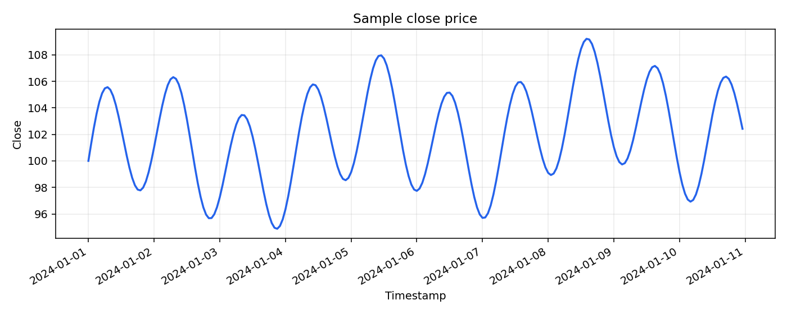
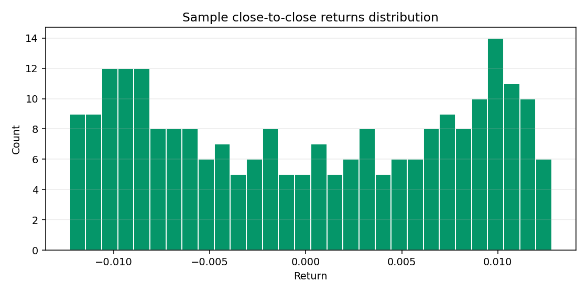
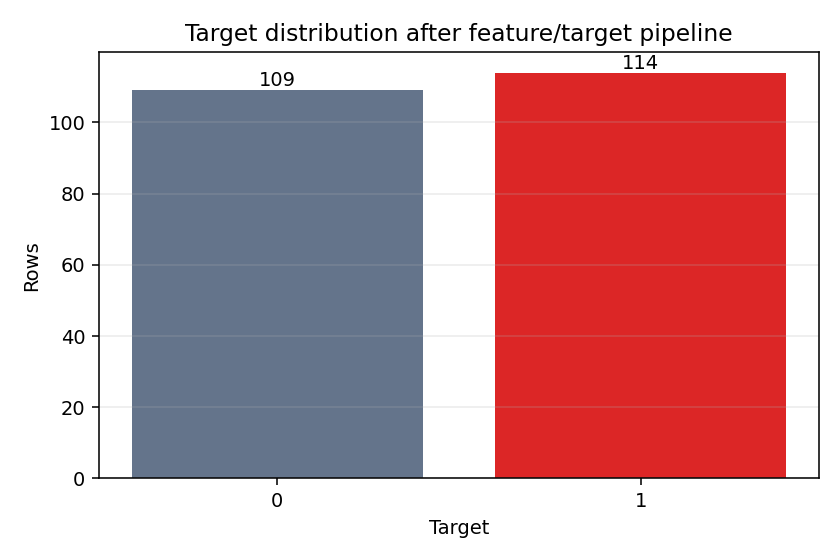

# EDA Report: Synthetic Sample OHLCV Dataset

## Dataset Scope

This report describes `data/samples/sample_ohlcv.csv`, the committed sample
dataset used for offline demo and smoke-check runs.

Dataset type: deterministic synthetic OHLCV sample. It is not Binance data and
must not be used for claims about market behavior, model quality, or trading
performance.

## Schema

| Field | Parsed type | Notes |
| --- | --- | --- |
| `timestamp` | datetime | Hourly timestamps used for chronological sorting. |
| `open` | numeric | Synthetic OHLCV open price. |
| `high` | numeric | Synthetic OHLCV high price. |
| `low` | numeric | Synthetic OHLCV low price. |
| `close` | numeric | Non-monotonic synthetic close price. |
| `volume` | numeric | Positive synthetic volume. |
| `symbol` | string | Single sample symbol, `BTCUSDT`. |

Rows: `240`

Columns:

```text
timestamp, open, high, low, close, volume, symbol
```

Timestamp range:

| Minimum timestamp | Maximum timestamp |
| --- | --- |
| `2024-01-01 00:00:00` | `2024-01-10 23:00:00` |

Symbol count:

| Metric | Value |
| --- | ---: |
| Unique symbols | 1 |
| Symbol value | `BTCUSDT` |

## Missing Values

| Column | Missing values |
| --- | ---: |
| `timestamp` | 0 |
| `open` | 0 |
| `high` | 0 |
| `low` | 0 |
| `close` | 0 |
| `volume` | 0 |
| `symbol` | 0 |

## Price And Volume Summary

| Statistic | open | high | low | close | volume |
| --- | ---: | ---: | ---: | ---: | ---: |
| count | 240.0000 | 240.0000 | 240.0000 | 240.0000 | 240.0000 |
| mean | 101.9391 | 103.1083 | 100.7854 | 101.9507 | 1488.0667 |
| std | 3.5102 | 3.4813 | 3.4976 | 3.5071 | 136.6579 |
| min | 94.8809 | 95.8981 | 94.1816 | 94.8809 | 1204.0000 |
| 25% | 99.1287 | 100.3129 | 98.0646 | 99.1287 | 1381.7500 |
| 50% | 102.0052 | 103.3595 | 100.7902 | 102.0538 | 1483.0000 |
| 75% | 105.0345 | 106.0917 | 103.6419 | 105.0345 | 1593.5000 |
| max | 109.2049 | 109.8713 | 108.2906 | 109.2049 | 1770.0000 |

The close series is intentionally non-monotonic so the target pipeline can
produce both binary classes.



## Returns Distribution

Returns are computed as one-step close-to-close percentage change with
`close.pct_change()`.

| Statistic | return |
| --- | ---: |
| count | 239.000000 |
| mean | 0.000131 |
| std | 0.007880 |
| min | -0.012308 |
| 25% | -0.007650 |
| 50% | 0.000205 |
| 75% | 0.007769 |
| max | 0.012820 |



## Target Balance After Current Pipeline

Target balance is computed through the current project pipeline:

```text
DataCleaner -> FeatureBuilder -> TargetBuilder(horizon=3)
```

The raw sample has `240` rows. After rolling feature windows and target horizon
trimming, the final dataset has `223` rows.

| Target | Rows | Share |
| --- | ---: | ---: |
| 0 | 109 | 48.88% |
| 1 | 114 | 51.12% |



## Short Findings

- The sample dataset matches the required OHLCV schema used by CSV ingestion.
- There are no missing values in the committed sample.
- The synthetic close series is non-monotonic, which prevents a one-class target
  in the default `horizon=3` smoke run.
- The target balance is close to even after the current feature and target
  pipeline.
- The dataset is suitable for reproducible offline pipeline validation.

## Caution

This EDA validates the shape and mechanical usefulness of the sample dataset. It
does not describe real crypto market behavior, does not estimate real returns,
and does not support claims about predictive performance.

## Regenerating Plots

The plots in this report were generated from the committed sample dataset:

```powershell
.crypto\Scripts\python.exe -m scripts.generate_sample_eda
```
