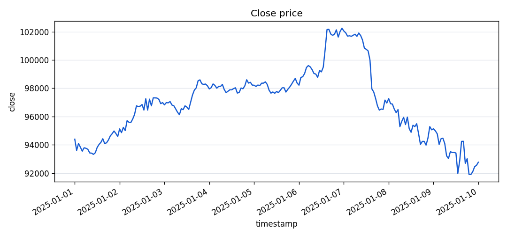
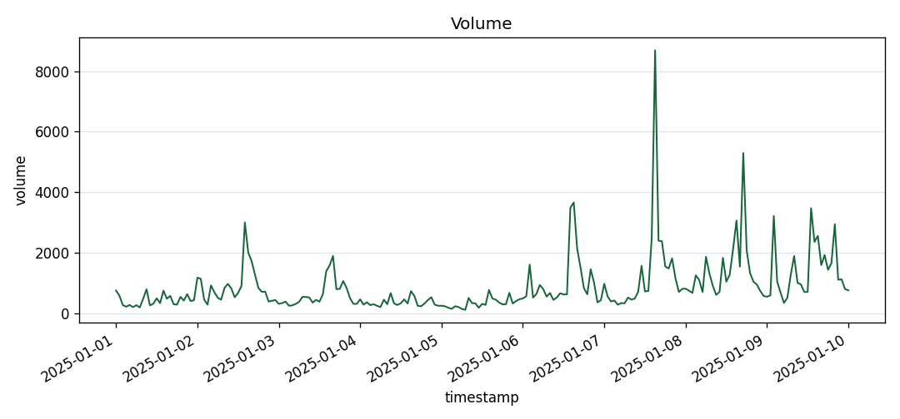
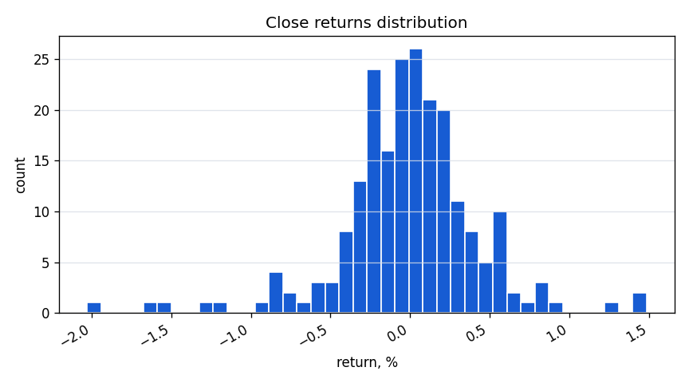
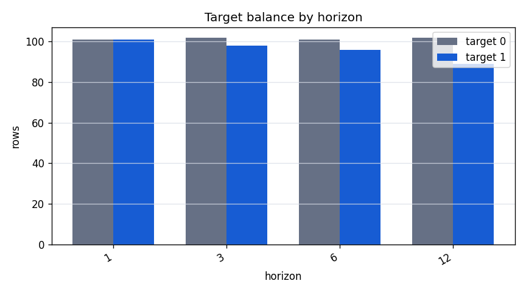
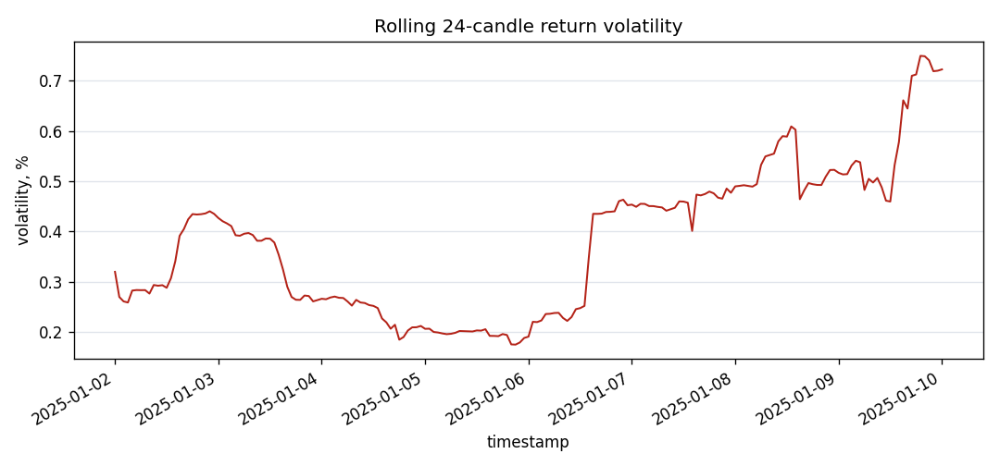

# Real Data EDA: Binance BTCUSDT 1h

## Purpose

This report documents a frozen real Binance OHLCV dataset before using it for
research benchmarks. The goal is descriptive data inspection, not a trading or
profitability claim.

## Dataset Manifest

| field | value |
| --- | --- |
| source | binance_spot_klines |
| symbol | BTCUSDT |
| interval | 1h |
| start_date | 2025-01-01 |
| end_date | 2025-01-10 |
| file_path | data/real/binance_BTCUSDT_1h_2025-01-01_2025-01-10.parquet |
| file_sha256 | cd9cf1076656725deb3118252c3a2c746c856b9136b3f94020e47f92cd34dfde |
| rows | 217 |
| timestamp_min | 2025-01-01T00:00:00 |
| timestamp_max | 2025-01-10T00:00:00 |
| duplicate_timestamps | 0 |
| created_at_utc | 2026-05-04T11:50:02+00:00 |

The dataset file itself is stored locally under `data/real/`, which is ignored
by git. The manifest records the frozen input parameters and SHA256 hash.

## Schema And Data Quality

| check | value |
| --- | --- |
| rows | 217 |
| columns | timestamp, open, high, low, close, volume, symbol |
| expected_rows | 217 |
| time_gap_count | 0 |
| duplicate_timestamps | 0 |
| missing_timestamp | 0 |
| missing_open | 0 |
| missing_high | 0 |
| missing_low | 0 |
| missing_close | 0 |
| missing_volume | 0 |
| missing_symbol | 0 |

## Price And Volume Overview





| column | min | max | mean | std |
| --- | --- | --- | --- | --- |
| open | 91903.210000 | 102235.600000 | 96953.839355 | 2485.298052 |
| high | 92371.320000 | 102724.380000 | 97252.103226 | 2457.445429 |
| low | 91203.670000 | 101950.000000 | 96647.583548 | 2551.159659 |
| close | 91903.220000 | 102235.600000 | 96950.143272 | 2490.936213 |
| volume | 118.311690 | 8692.129320 | 880.284655 | 919.901361 |

## Returns Distribution



| metric | value |
| --- | --- |
| count | 216 |
| min | -0.020278 |
| max | 0.014863 |
| mean | -0.000071 |
| std | 0.004345 |

## Target Balance By Horizon



| horizon | final_rows | target_0_count | target_1_count | positive_rate |
| --- | --- | --- | --- | --- |
| 1 | 202 | 101 | 101 | 0.5000 |
| 3 | 200 | 102 | 98 | 0.4900 |
| 6 | 197 | 101 | 96 | 0.4873 |
| 12 | 191 | 102 | 89 | 0.4660 |

## Volatility Overview



The volatility plot shows a rolling 24-candle standard deviation of close
returns. It is a descriptive diagnostic for the selected period only.

## Leakage Notes

Target balance is computed by the same `DataCleaner`, `FeatureBuilder`, and
`TargetBuilder` path used by the pipeline. The future close used to create the
binary target is not kept as a model feature. Timestamp, symbol, and target are
not intended to be training features.

## Limitations

- This is one symbol, interval, and period.
- Market behavior is non-stationary; descriptive distributions can change.
- Target balance depends on the selected horizon and date range.
- No fees, slippage, execution constraints, or live monitoring are modeled.
- This EDA does not prove market predictability or trading profitability.

## Reproducibility

Regenerate this report with:

```powershell
.crypto\Scripts\python.exe scripts\generate_real_data_eda.py --dataset data\real\binance_BTCUSDT_1h_2025-01-01_2025-01-10.parquet --manifest data\real\binance_BTCUSDT_1h_2025-01-01_2025-01-10.manifest.json --output-doc docs\real_data_eda.md --output-dir docs\assets\real_data_eda --horizons 1,3,6,12
```
