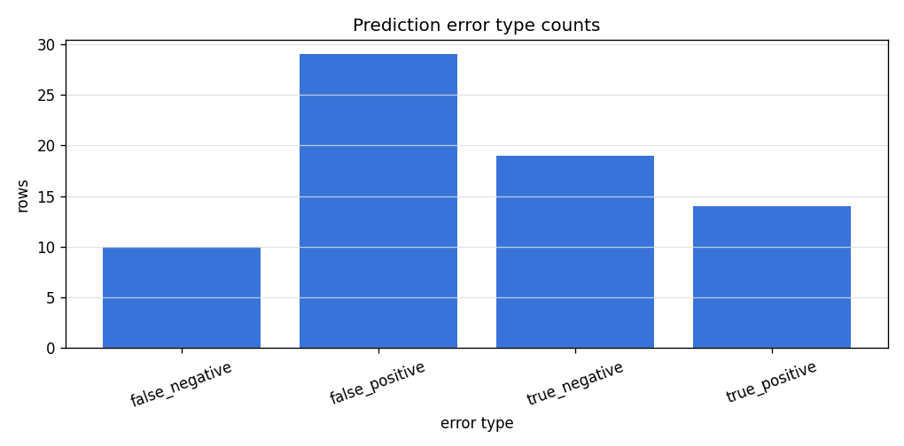
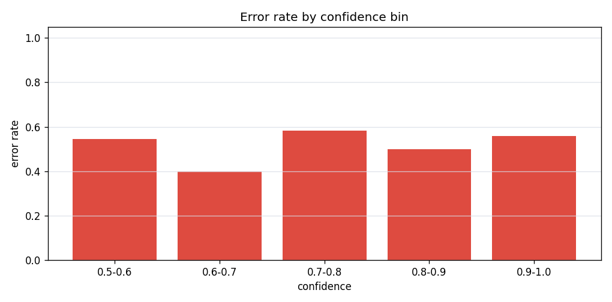
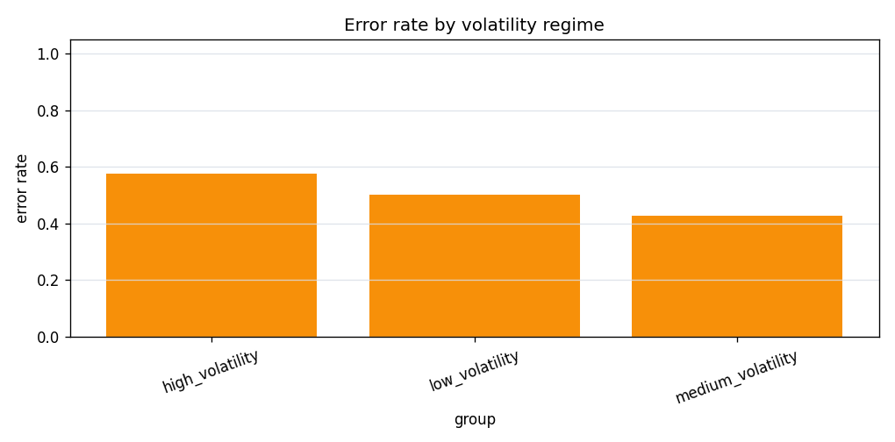
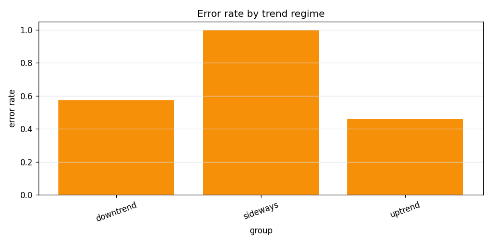

# Real Data Error Analysis

## Purpose

This report inspects false positives, false negatives, correct predictions,
model confidence, and regime-specific error rates for walk-forward test
fold predictions. It is diagnostic analysis, not a trading strategy.

## Dataset

| field | value |
| --- | --- |
| source | binance_spot_klines |
| symbol | BTCUSDT |
| interval | 1h |
| start_date | 2025-01-01 |
| end_date | 2025-01-10 |
| file_path | data/real/binance_BTCUSDT_1h_2025-01-01_2025-01-10.parquet |
| file_sha256 | cd9cf1076656725deb3118252c3a2c746c856b9136b3f94020e47f92cd34dfde |
| rows | 217 |
| timestamp_min | 2025-01-01T00:00:00 |
| timestamp_max | 2025-01-10T00:00:00 |

Final feature/target rows after pipeline preparation: `200`.
Walk-forward prediction rows used for error analysis: `72`.

## Walk-Forward Setup

| parameter | value |
| --- | --- |
| trainer | baseline |
| target_horizon | 3 |
| train_window | 120 |
| test_window | 24 |
| step | 24 |
| folds_with_predictions | 3 |
| fold_errors | 0 |
| trend_window | 24 |
| trend_threshold | 0.0100 |
| top_n | 10 |
| random_shuffle | no |

## Error Type Summary

Definitions:

- `false_positive`: model predicted `up`, actual direction was `down`.
- `false_negative`: model predicted `down`, actual direction was `up`.
- `true_positive`: model predicted `up`, actual direction was `up`.
- `true_negative`: model predicted `down`, actual direction was `down`.

Summary CSV: [`error_summary_baseline.csv`](assets/real_data_error_analysis/error_summary_baseline.csv)



| total_rows | correct_count | error_count | error_rate | true_positive_count | true_negative_count | false_positive_count | false_negative_count | false_positive_rate | false_negative_rate | avg_confidence_correct | avg_confidence_wrong |
| --- | --- | --- | --- | --- | --- | --- | --- | --- | --- | --- | --- |
| 72 | 33 | 39 | 0.5417 | 14 | 19 | 29 | 10 | 0.6042 | 0.4167 | 0.8333 | 0.8252 |

## High-Confidence Errors

High-confidence mistakes are useful model-risk examples because the model
was confident while still wrong.

CSV output: [`high_confidence_errors_baseline.csv`](assets/real_data_error_analysis/high_confidence_errors_baseline.csv)

| timestamp | fold_id | close | y_true | y_pred | y_proba | confidence | error_type | volatility_regime | trend_regime |
| --- | --- | --- | --- | --- | --- | --- | --- | --- | --- |
| 2025-01-07 15:00:00 | 2 | 97952.2600 | 0 | 1 | 0.9995 | 0.9995 | false_positive | high_volatility | downtrend |
| 2025-01-07 18:00:00 | 2 | 96750.8600 | 0 | 1 | 0.9985 | 0.9985 | false_positive | high_volatility | downtrend |
| 2025-01-07 17:00:00 | 2 | 97277.3100 | 0 | 1 | 0.9984 | 0.9984 | false_positive | high_volatility | downtrend |
| 2025-01-06 20:00:00 | 1 | 102127.3800 | 1 | 0 | 0.0034 | 0.9966 | false_negative | high_volatility | uptrend |
| 2025-01-06 19:00:00 | 1 | 101817.2200 | 1 | 0 | 0.0051 | 0.9949 | false_negative | high_volatility | uptrend |
| 2025-01-07 16:00:00 | 2 | 97733.5800 | 0 | 1 | 0.9942 | 0.9942 | false_positive | high_volatility | downtrend |
| 2025-01-07 03:00:00 | 1 | 101708.0800 | 1 | 0 | 0.0107 | 0.9893 | false_negative | high_volatility | uptrend |
| 2025-01-08 09:00:00 | 2 | 95432.8200 | 0 | 1 | 0.9793 | 0.9793 | false_positive | high_volatility | downtrend |
| 2025-01-07 11:00:00 | 1 | 100830.8600 | 0 | 1 | 0.9554 | 0.9554 | false_positive | medium_volatility | uptrend |
| 2025-01-07 02:00:00 | 1 | 101677.6600 | 1 | 0 | 0.0456 | 0.9544 | false_negative | high_volatility | uptrend |

## Error Rate By Confidence

CSV output: [`probability_bin_errors_baseline.csv`](assets/real_data_error_analysis/probability_bin_errors_baseline.csv)



| confidence_bin | rows | correct_count | error_count | error_rate |
| --- | --- | --- | --- | --- |
| 0.5-0.6 | 11 | 5 | 6 | 0.5455 |
| 0.6-0.7 | 5 | 3 | 2 | 0.4000 |
| 0.7-0.8 | 12 | 5 | 7 | 0.5833 |
| 0.8-0.9 | 10 | 5 | 5 | 0.5000 |
| 0.9-1.0 | 34 | 15 | 19 | 0.5588 |

## Error Rate By Volatility Regime



| group | rows | correct_count | error_count | error_rate | false_positive_count | false_negative_count |
| --- | --- | --- | --- | --- | --- | --- |
| high_volatility | 52 | 22 | 30 | 0.5769 | 21 | 9 |
| low_volatility | 6 | 3 | 3 | 0.5000 | 3 | 0 |
| medium_volatility | 14 | 8 | 6 | 0.4286 | 5 | 1 |

## Error Rate By Trend Regime



| group | rows | correct_count | error_count | error_rate | false_positive_count | false_negative_count |
| --- | --- | --- | --- | --- | --- | --- |
| downtrend | 47 | 20 | 27 | 0.5745 | 24 | 3 |
| sideways | 1 | 0 | 1 | 1.0000 | 1 | 0 |
| uptrend | 24 | 13 | 11 | 0.4583 | 4 | 7 |

## Interpretation

The smoke run produced `39` errors out of `72` predictions (error rate `0.5417`).

False positives: `29`; false negatives: `10`.

The most confident mistake in this run has confidence `0.9995` and type `false_positive`.

These examples are useful for model-risk inspection and should be re-run on longer frozen periods before drawing stronger conclusions.

## Limitations

- The smoke dataset is short and has few folds.
- Confidence comes from classifier probability output, not calibrated odds.
- Regime thresholds are heuristic diagnostics.
- The target is directional classification only.
- No fees, slippage, sizing, or execution constraints are modeled.
- This report does not imply profitability or deployable market edge.

## Reproducibility

Regenerate this report with:

```powershell
.crypto\Scripts\python.exe scripts\run_real_data_error_analysis.py --dataset data\real\binance_BTCUSDT_1h_2025-01-01_2025-01-10.parquet --manifest data\real\binance_BTCUSDT_1h_2025-01-01_2025-01-10.manifest.json --output-doc docs\real_data_error_analysis.md --output-dir docs\assets\real_data_error_analysis --trainer baseline --target-horizon 3 --train-window 120 --test-window 24 --step 24 --trend-window 24 --trend-threshold 0.01 --top-n 10
```
