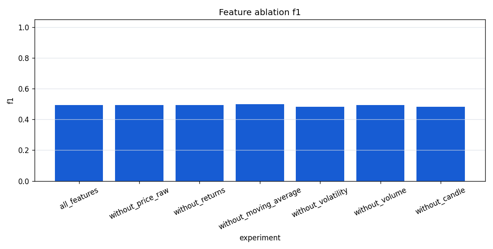
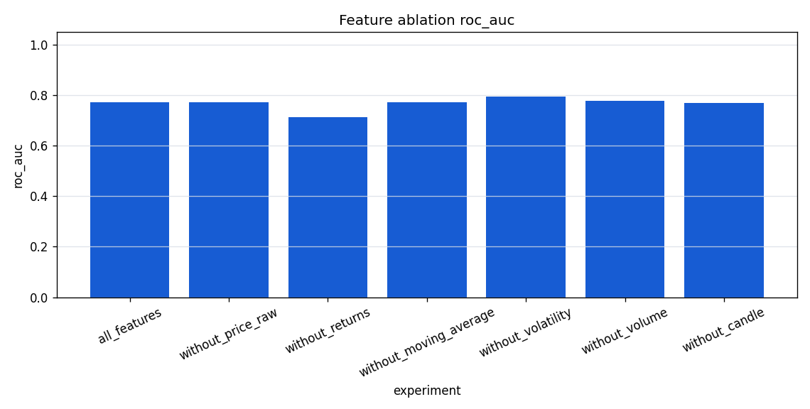
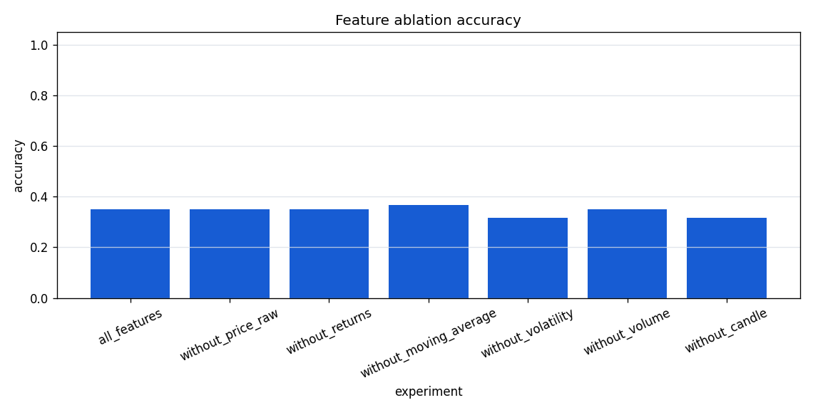

# Real Data Feature Ablation

## Purpose

This report checks which engineered OHLCV feature groups contribute most to
directional classification metrics on a frozen real Binance dataset.
Feature ablation is diagnostic feature analysis, not a trading strategy.

## Dataset

| field | value |
| --- | --- |
| source | binance_spot_klines |
| symbol | BTCUSDT |
| interval | 1h |
| start_date | 2025-01-01 |
| end_date | 2025-01-10 |
| file_path | data/real/binance_BTCUSDT_1h_2025-01-01_2025-01-10.parquet |
| file_sha256 | cd9cf1076656725deb3118252c3a2c746c856b9136b3f94020e47f92cd34dfde |
| rows | 217 |
| timestamp_min | 2025-01-01T00:00:00 |
| timestamp_max | 2025-01-10T00:00:00 |

Final feature/target rows after pipeline preparation: `200`.

## Feature Groups

| feature_group | columns |
| --- | --- |
| price_raw | open, high, low, close |
| returns | return_1, return_3, return_6, return_12 |
| moving_average | ma_7, ma_14, ema_7, ema_30 |
| volatility | volatility_7, volatility_14 |
| volume | volume, volume_change, volume_ma_7 |
| candle | candle_body, candle_range |

## Setup

| parameter | value |
| --- | --- |
| trainer | baseline |
| target_horizon | 3 |
| train_ratio | 0.7000 |
| train_rows | 140 |
| test_rows | 60 |
| mode | drop_groups |
| random_shuffle | no |

The split is chronological. The first segment is train data and the later
segment is test data. No random shuffle is used.

## Results

CSV output: [`feature_ablation_baseline_drop_groups.csv`](assets/real_data_feature_ablation/feature_ablation_baseline_drop_groups.csv)







| experiment | mode | feature_group | included_feature_count | excluded_group | accuracy | precision | recall | f1 | roc_auc | error_message |
| --- | --- | --- | --- | --- | --- | --- | --- | --- | --- | --- |
| all_features | drop_groups | all_features | 19 | - | 0.3500 | 0.3276 | 1.0000 | 0.4935 | 0.7715 | - |
| without_price_raw | drop_groups | price_raw | 15 | price_raw | 0.3500 | 0.3276 | 1.0000 | 0.4935 | 0.7702 | - |
| without_returns | drop_groups | returns | 15 | returns | 0.3500 | 0.3276 | 1.0000 | 0.4935 | 0.7112 | - |
| without_moving_average | drop_groups | moving_average | 15 | moving_average | 0.3667 | 0.3333 | 1.0000 | 0.5000 | 0.7715 | - |
| without_volatility | drop_groups | volatility | 17 | volatility | 0.3167 | 0.3167 | 1.0000 | 0.4810 | 0.7946 | - |
| without_volume | drop_groups | volume | 16 | volume | 0.3500 | 0.3276 | 1.0000 | 0.4935 | 0.7766 | - |
| without_candle | drop_groups | candle | 17 | candle | 0.3167 | 0.3167 | 1.0000 | 0.4810 | 0.7689 | - |

## Interpretation

The strongest experiment by F1 in this smoke run is `without_moving_average` with F1 `0.5000`.

The largest F1 delta versus all features is `without_moving_average` with delta `0.0065`.

These comparisons are diagnostic and should be re-run on longer frozen periods and walk-forward splits before drawing stronger conclusions.

Feature importance and ablation answer different questions: feature
importance ranks model usage, while ablation checks what happens when groups
are removed or isolated.

## Limitations

- This report uses one frozen symbol, interval, and date range.
- The smoke dataset is short.
- The ablation setup uses one chronological split, not walk-forward folds.
- Removing a group can help or hurt depending on the selected period.
- Metrics are directional classification metrics only.
- Results do not imply profitability or deployable market edge.

## Reproducibility

Regenerate this report with:

```powershell
.crypto\Scripts\python.exe scripts\run_real_data_feature_ablation.py --dataset data\real\binance_BTCUSDT_1h_2025-01-01_2025-01-10.parquet --manifest data\real\binance_BTCUSDT_1h_2025-01-01_2025-01-10.manifest.json --output-doc docs\real_data_feature_ablation.md --output-dir docs\assets\real_data_feature_ablation --trainer baseline --target-horizon 3 --train-ratio 0.7 --mode drop_groups
```
