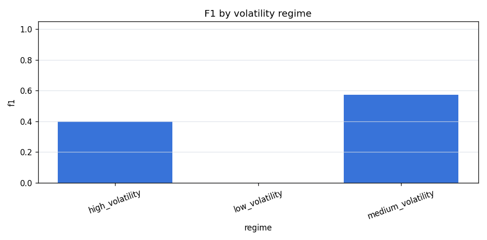
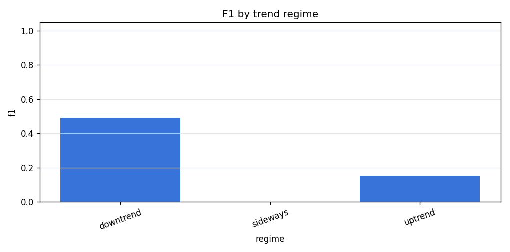
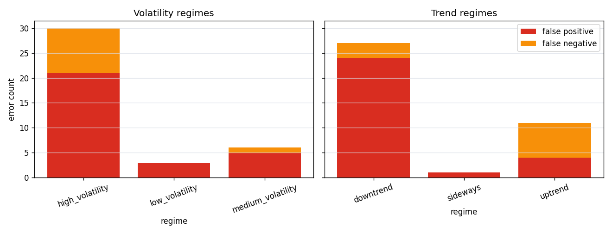

# Real Data Regime Analysis

## Purpose

This report checks where a walk-forward directional classifier performs
better or worse across simple volatility and trend regimes. It is
diagnostic error analysis, not a market strategy or trading claim.

## Dataset

| field | value |
| --- | --- |
| source | binance_spot_klines |
| symbol | BTCUSDT |
| interval | 1h |
| start_date | 2025-01-01 |
| end_date | 2025-01-10 |
| file_path | data/real/binance_BTCUSDT_1h_2025-01-01_2025-01-10.parquet |
| file_sha256 | cd9cf1076656725deb3118252c3a2c746c856b9136b3f94020e47f92cd34dfde |
| rows | 217 |
| timestamp_min | 2025-01-01T00:00:00 |
| timestamp_max | 2025-01-10T00:00:00 |

Final feature/target rows after pipeline preparation: `200`.
Walk-forward prediction rows used for regime analysis: `72`.

## Walk-Forward Setup

| parameter | value |
| --- | --- |
| trainer | baseline |
| target_horizon | 3 |
| train_window | 120 |
| test_window | 24 |
| step | 24 |
| folds_with_predictions | 3 |
| fold_errors | 0 |
| random_shuffle | no |

## Regime Definitions

- Volatility regimes use `volatility_14` when available and split valid
  values into low/medium/high buckets by 33% and 66% quantiles.
- Trend regimes use `close.pct_change(24)`.
- `trend_return > 0.01` is `uptrend`.
- `trend_return < -0.01` is `downtrend`.
- Values between the thresholds are `sideways`; missing values are labeled
  as unknown regimes.

## Metrics By Volatility Regime

CSV output: [`regime_metrics_by_volatility_baseline.csv`](assets/real_data_regime_analysis/regime_metrics_by_volatility_baseline.csv)



| regime | rows | positive_rate | accuracy | precision | recall | f1 | roc_auc | false_positive_count | false_negative_count |
| --- | --- | --- | --- | --- | --- | --- | --- | --- | --- |
| high_volatility | 52 | 0.3654 | 0.4231 | 0.3226 | 0.5263 | 0.4000 | 0.4673 | 21 | 9 |
| low_volatility | 6 | 0.0000 | 0.5000 | 0.0000 | 0.0000 | 0.0000 | - | 3 | 0 |
| medium_volatility | 14 | 0.3571 | 0.5714 | 0.4444 | 0.8000 | 0.5714 | 0.6667 | 5 | 1 |

## Metrics By Trend Regime

CSV output: [`regime_metrics_by_trend_baseline.csv`](assets/real_data_regime_analysis/regime_metrics_by_trend_baseline.csv)



| regime | rows | positive_rate | accuracy | precision | recall | f1 | roc_auc | false_positive_count | false_negative_count |
| --- | --- | --- | --- | --- | --- | --- | --- | --- | --- |
| downtrend | 47 | 0.3404 | 0.4255 | 0.3514 | 0.8125 | 0.4906 | 0.5806 | 24 | 3 |
| sideways | 1 | 0.0000 | 0.0000 | 0.0000 | 0.0000 | 0.0000 | - | 1 | 0 |
| uptrend | 24 | 0.3333 | 0.5417 | 0.2000 | 0.1250 | 0.1538 | 0.3828 | 4 | 7 |

## Error Analysis

Predictions CSV: [`regime_predictions_baseline.csv`](assets/real_data_regime_analysis/regime_predictions_baseline.csv)



False positives and false negatives are counted inside each regime bucket.
Small regime buckets can make these counts noisy.

## Interpretation

The strongest volatility bucket by F1 in this smoke run is `medium_volatility` with F1 `0.5714`.

The strongest trend bucket by F1 in this smoke run is `downtrend` with F1 `0.4906`.

These comparisons are diagnostic and should be re-run on longer frozen periods before drawing stronger conclusions.

## Limitations

- Regime labels are simple diagnostics, not market-state truth.
- Trend thresholds are heuristic and should be varied in future runs.
- The smoke dataset is short, so some regime buckets have low row counts.
- Metrics by regime do not include fees, slippage, execution constraints,
  or position sizing.
- Results do not imply profitability or deployable market edge.

## Reproducibility

Regenerate this report with:

```powershell
.crypto\Scripts\python.exe scripts\run_real_data_regime_analysis.py --dataset data\real\binance_BTCUSDT_1h_2025-01-01_2025-01-10.parquet --manifest data\real\binance_BTCUSDT_1h_2025-01-01_2025-01-10.manifest.json --output-doc docs\real_data_regime_analysis.md --output-dir docs\assets\real_data_regime_analysis --trainer baseline --target-horizon 3 --train-window 120 --test-window 24 --step 24 --trend-window 24 --trend-threshold 0.01
```
