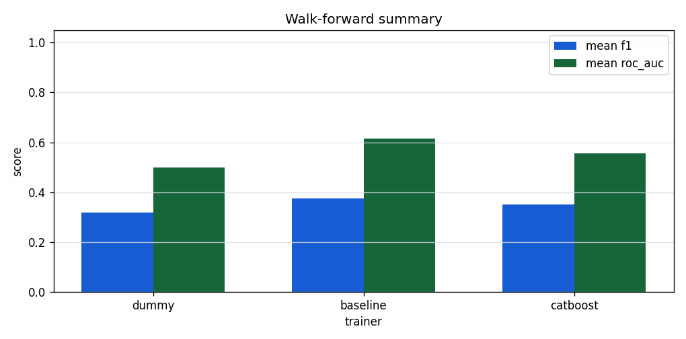
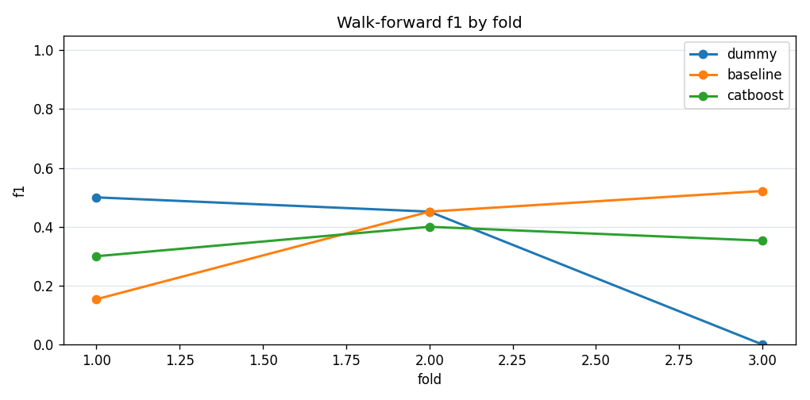
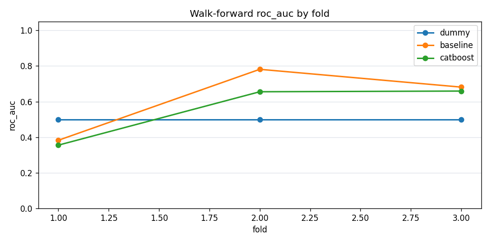

# Real Data Walk-Forward Benchmark

## Purpose

This report records a first walk-forward benchmark on a frozen real Binance
OHLCV dataset. It compares directional classification metrics across
sequential time folds. The goal is signal stability inspection, not a
trading or profitability claim.

## Dataset

| field | value |
| --- | --- |
| source | binance_spot_klines |
| symbol | BTCUSDT |
| interval | 1h |
| start_date | 2025-01-01 |
| end_date | 2025-01-10 |
| file_path | data/real/binance_BTCUSDT_1h_2025-01-01_2025-01-10.parquet |
| file_sha256 | cd9cf1076656725deb3118252c3a2c746c856b9136b3f94020e47f92cd34dfde |
| rows | 217 |
| timestamp_min | 2025-01-01T00:00:00 |
| timestamp_max | 2025-01-10T00:00:00 |

Final feature/target rows after pipeline preparation: `200`.

## Feature/Target Pipeline

- `DataCleaner` validates and sorts OHLCV rows.
- `FeatureBuilder` creates returns, moving averages, volatility, volume, and
  candle-shape features.
- `TargetBuilder(horizon=3)` creates `target = 1` when
  `close(t+horizon) > close(t)`.
- Timestamp, symbol, and target are excluded from model features.

## Walk-Forward Setup

| parameter | value |
| --- | --- |
| target_horizon | 3 |
| train_window | 120 |
| test_window | 24 |
| step | 24 |
| random_shuffle | no |
| test_fold_tuning | no |

Each fold trains on an earlier chronological window and evaluates on the
following test window. One-class folds can fail for non-dummy models; failed
folds are counted and kept in the CSV outputs.

## Models

- `dummy`: `DummyClassifier` majority-class baseline.
- `baseline`: LogisticRegression with StandardScaler.
- `catboost`: CatBoostClassifier with lightweight research parameters
  (`iterations=20`, `depth=4`, `learning_rate=0.1`).

## Summary Results



| trainer | folds_total | folds_failed | folds_success | accuracy_mean | accuracy_std | f1_mean | f1_std | roc_auc_mean | roc_auc_std | precision_mean | recall_mean |
| --- | --- | --- | --- | --- | --- | --- | --- | --- | --- | --- | --- |
| dummy | 3 | 0 | 3 | 0.4167 | 0.1816 | 0.3172 | 0.2758 | 0.5000 | 0.0000 | 0.2083 | 0.6667 |
| baseline | 3 | 0 | 3 | 0.4583 | 0.1443 | 0.3757 | 0.1953 | 0.6153 | 0.2074 | 0.3067 | 0.5972 |
| catboost | 3 | 0 | 3 | 0.4444 | 0.0867 | 0.3510 | 0.0500 | 0.5567 | 0.1743 | 0.3009 | 0.4742 |

## Fold-Level Results





### dummy

CSV output: [`walk_forward_dummy.csv`](assets/real_data_walk_forward/walk_forward_dummy.csv)

| fold_id | train_start | test_start | accuracy | precision | recall | f1 | roc_auc | error_message |
| --- | --- | --- | --- | --- | --- | --- | --- | --- |
| 1 | 2025-01-01 14:00:00 | 2025-01-06 14:00:00 | 0.3333 | 0.3333 | 1.0000 | 0.5000 | 0.5000 | - |
| 2 | 2025-01-02 14:00:00 | 2025-01-07 14:00:00 | 0.2917 | 0.2917 | 1.0000 | 0.4516 | 0.5000 | - |
| 3 | 2025-01-03 14:00:00 | 2025-01-08 14:00:00 | 0.6250 | 0.0000 | 0.0000 | 0.0000 | 0.5000 | - |

### baseline

CSV output: [`walk_forward_baseline.csv`](assets/real_data_walk_forward/walk_forward_baseline.csv)

| fold_id | train_start | test_start | accuracy | precision | recall | f1 | roc_auc | error_message |
| --- | --- | --- | --- | --- | --- | --- | --- | --- |
| 1 | 2025-01-01 14:00:00 | 2025-01-06 14:00:00 | 0.5417 | 0.2000 | 0.1250 | 0.1538 | 0.3828 | - |
| 2 | 2025-01-02 14:00:00 | 2025-01-07 14:00:00 | 0.2917 | 0.2917 | 1.0000 | 0.4516 | 0.7815 | - |
| 3 | 2025-01-03 14:00:00 | 2025-01-08 14:00:00 | 0.5417 | 0.4286 | 0.6667 | 0.5217 | 0.6815 | - |

### catboost

CSV output: [`walk_forward_catboost.csv`](assets/real_data_walk_forward/walk_forward_catboost.csv)

| fold_id | train_start | test_start | accuracy | precision | recall | f1 | roc_auc | error_message |
| --- | --- | --- | --- | --- | --- | --- | --- | --- |
| 1 | 2025-01-01 14:00:00 | 2025-01-06 14:00:00 | 0.4167 | 0.2500 | 0.3750 | 0.3000 | 0.3555 | - |
| 2 | 2025-01-02 14:00:00 | 2025-01-07 14:00:00 | 0.3750 | 0.2778 | 0.7143 | 0.4000 | 0.6555 | - |
| 3 | 2025-01-03 14:00:00 | 2025-01-08 14:00:00 | 0.5417 | 0.3750 | 0.3333 | 0.3529 | 0.6593 | - |

## Interpretation

By mean F1, the strongest trainer in this run is `baseline` (mean F1 `0.3757`, mean ROC AUC `0.6153`). This comparison is descriptive and should be re-run on longer frozen periods before drawing stronger conclusions.

The benchmark should be interpreted as a stability check, not as evidence of
deployable market edge.

## Limitations

- This benchmark uses one frozen symbol, interval, and date range.
- The smoke dataset is short; fold counts are limited.
- Classification metrics do not include fees, slippage, position sizing, or
  execution constraints.
- No hyperparameter tuning is performed inside this script.
- Market behavior is non-stationary, so these metrics can degrade on other
  periods.

## Reproducibility

Regenerate this report with:

```powershell
.crypto\Scripts\python.exe scripts\run_real_data_walk_forward_benchmark.py --dataset data\real\binance_BTCUSDT_1h_2025-01-01_2025-01-10.parquet --manifest data\real\binance_BTCUSDT_1h_2025-01-01_2025-01-10.manifest.json --output-doc docs\real_data_walk_forward_benchmark.md --output-dir docs\assets\real_data_walk_forward --target-horizon 3 --train-window 120 --test-window 24 --step 24 --trainers dummy,baseline,catboost
```
